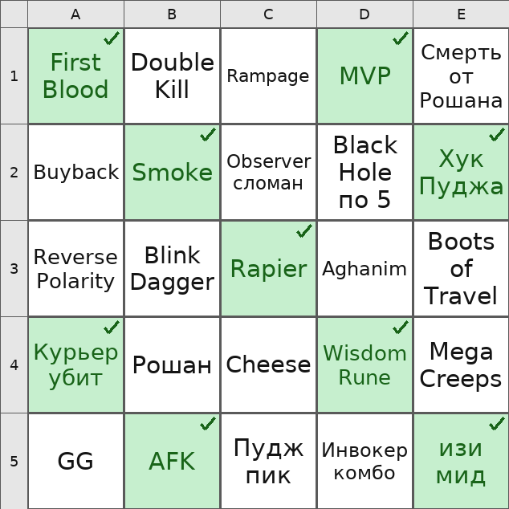

# Bingo Bot

A Telegram bot for playing "prediction bingo": the organizer creates a game,
and participants either write their own 25 (or 4/9/16) predictions on a card
or get one randomly assembled from a shared phrase pool. Cells get marked off
as predictions come true; the first player to fill their whole card wins.

<p align="center">
  
</p>

## Features

- **Two card-filling modes**: manual (each player writes their own phrases) or
  random — cards are assembled from a shared pool (a file/message from the
  organizer, a 10-phrase example, or a built-in default list).
- **Card rendered as an image** — drawn with Pillow: a grid with battleship-style
  coordinates (A1…E5), closed cells highlighted, per-cell font size that scales
  to fit the text.
- **Anonymous mode** — other players' unmarked cell text stays hidden until the
  owner marks it themselves.
- **Marking cells** by number or coordinate (`5` or `B5`/`5B`), with one-tap
  undo of the last mark.
- **Multiple concurrent games** — the bot tracks which active game and which
  draft game a user is currently working with, without mixing them up.
- **Export cards to `.txt`** for active/finished games — the same format can be
  fed back in as a phrase pool for the random mode.
- Resilient to repeated taps on stale buttons, auto-fills lagging players'
  cards on a forced start, and sends targeted notifications to organizers and
  participants.

## Stack

Python 3.11+, [aiogram 3](https://docs.aiogram.dev/), aiosqlite (SQLite file
storage), Pillow (card rendering), python-dotenv.

## Running locally

```bash
git clone <this-repo>
cd bingo
python -m venv .venv
source .venv/bin/activate   # Windows: .venv\Scripts\Activate.ps1
pip install -r requirements.txt

cp .env.example .env        # fill in your token from @BotFather in BOT_TOKEN
python bot.py
```

Get a bot token from [@BotFather](https://t.me/BotFather) with `/newbot`.
The bot uses long polling, so no public HTTPS endpoint is required — just
outbound internet access.

## Deployment

[`deploy/bingo-bot.service`](deploy/bingo-bot.service) is a systemd unit
template for running the bot as a service on a Linux server (tested on Oracle
Linux 9, Oracle Cloud Always Free). [`deploy/RUNBOOK.md`](deploy/RUNBOOK.md)
covers day-to-day operations and troubleshooting.
